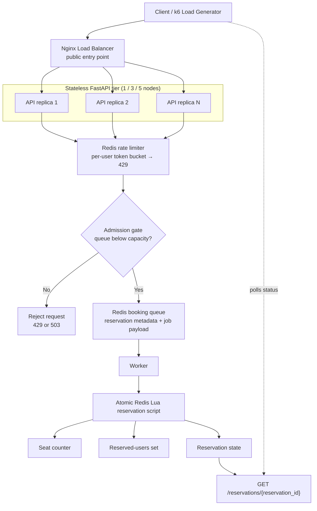

# SE3S Prototyping Assignment 1

This repository contains a scalable ticket-reservation prototype for the SE3S prototyping assignment. The system is designed for flash-sale style demand and focuses on protecting correctness under load while making scalability trade-offs explicit and measurable.

The current prototype combines:

- an `Nginx` load balancer
- a horizontally scalable `FastAPI` API tier
- Redis-backed per-user rate limiting
- a Redis-backed admission gate for queue backpressure
- an asynchronous booking queue
- a worker that resolves bookings with an atomic Redis Lua script
- a reservation-status endpoint for asynchronous clients
- local Docker-based execution and a reproducible GCP Terraform deployment for `1`, `3`, and `5` node experiments

## Prototype Goal

The prototype models a reservation workflow where high request volume must not:

- oversell seats
- allow unbounded queue growth
- let one user dominate the system

Instead of handling booking synchronously in the request path, the API admits valid requests into a queue, returns a `pending` reservation, and lets a worker resolve the final outcome atomically in Redis.

This makes the prototype suitable for demonstrating:

- horizontal scaling of the stateless API layer
- correctness of the reservation decision under concurrency
- overload protection through rate limiting and admission control
- the remaining bottleneck of a singular stateful backend and worker path

## Architecture

The diagram below reflects the current implementation and the deployment shape used for local development and the GCP experiments.



## Request Flow

1. A client submits `POST /events/{event_id}/book` with a `user_id`.
2. The API checks the per-user Redis token bucket.
3. If the user is throttled, the API returns `429`.
4. If the user passes the limiter, the API checks the admission gate.
5. If the queue is already at capacity, the API returns `503`.
6. Otherwise, the API stores reservation metadata, enqueues the booking job, and returns a `pending` reservation.
7. The worker consumes queue items and calls the atomic Redis Lua script.
8. The Lua script decides the final outcome without overselling.
9. The client reads the final status through `GET /reservations/{reservation_id}`.

## Reservation Outcomes

The current prototype uses these detailed statuses:

- `pending`
- `reserved`
- `sold_out`
- `duplicate`
- `event_not_found`

## Scaling Process

This prototype supports both horizontal scaling and vertical scaling through the GCP Terraform deployment.

### Scaling Out And In

Scaling out and in changes the number of API-serving VMs while keeping the machine type fixed.

- the control parameter is `node_count`
- supported configurations are `1`, `3`, and `5`
- node `0` always remains the coordinator
- the coordinator hosts `Nginx`, Redis, one worker, and one API replica
- additional nodes are stateless API-only replicas

Operationally, scaling out means:

1. change `node_count` to a larger value
2. run `terraform apply` directly or use `scripts/gcp/deploy.sh -n 3` / `-n 5`
3. Terraform creates the additional API nodes
4. the generated `Nginx` configuration is updated so the load balancer forwards traffic to the larger backend set

Scaling in is the reverse process:

1. reduce `node_count`
2. re-apply the Terraform deployment
3. Terraform removes the excess stateless API replicas
4. `Nginx` is reconfigured to use the smaller backend set

Because the API tier is stateless, scaling out and in is comparatively simple. No booking state has to be moved between API replicas. The stateful parts remain on Redis, and reservation correctness stays anchored in the single Redis plus Lua path.

### Scaling Up And Down

Scaling up and down changes the machine type while keeping the cluster shape fixed.

- the control parameter is `machine_type`
- the default deployment uses an `E2` machine type
- stronger machine families such as `N2` can be tested by changing the machine type in Terraform or via `scripts/gcp/deploy.sh -m ...`

Operationally, scaling up means:

1. keep `node_count` fixed
2. select a larger machine type
3. redeploy or re-apply the Terraform configuration

Scaling down is the inverse:

1. keep `node_count` fixed
2. switch back to a smaller machine type
3. re-apply the deployment

In this prototype, scaling up and down is a deployment-time operation, not a live autoscaling mechanism. We intentionally use separate, reproducible deployments for each measurement run so the results stay comparable.

## Measured Scalability Impacts

We measured the system using the baseline throughput scenario and compared both horizontal scaling (`1`, `3`, `5` nodes) and vertical scaling (`E2` versus `N2` machines).

### Throughput Results

| Cluster configuration | Req/s on E2 | Req/s on N2 |
| --- | ---: | ---: |
| Single-node instance | 358.72 | 596.36 |
| 3 node-cluster | 1049.75 | 1733.43 |
| 5 node-cluster | 1478.37 | 2538.61 |

### Observed Horizontal Scaling Impact

With the same machine family, adding API nodes increased throughput clearly:

- on `E2`, throughput grew from `358.72 req/s` at `1` node to `1049.75 req/s` at `3` nodes and `1478.37 req/s` at `5` nodes
- on `N2`, throughput grew from `596.36 req/s` at `1` node to `1733.43 req/s` at `3` nodes and `2538.61 req/s` at `5` nodes

This shows that scaling out the stateless API tier has a strong positive impact on requests handled per second.

The growth is substantial, but not perfectly linear. That is expected because Redis, the worker path, and the atomic reservation logic remain singular. In other words, the API layer scales better than the full end-to-end reservation pipeline.

### Observed Vertical Scaling Impact

For every cluster size, moving from `E2` to `N2` increased throughput significantly:

- single-node: `358.72 -> 596.36 req/s`
- 3-node cluster: `1049.75 -> 1733.43 req/s`
- 5-node cluster: `1478.37 -> 2538.61 req/s`

That means the stronger machine family improved throughput by roughly `65%` to `72%` across the tested configurations.

This is the measured elasticity impact in our setup: when we scale the same deployment shape up to stronger machines, the system handles materially more load without changing the application logic.

### Interpretation

The measurements show two things clearly:

- scaling out improves the capacity of the stateless API tier
- scaling up improves the per-node processing capacity of the same architecture

At the same time, the results also reveal the current limitation of the prototype:

- the system benefits strongly from more and stronger API nodes
- but end-to-end scalability is still constrained by the singular Redis and worker path

This limitation is acceptable for the assignment because it makes the trade-off visible: the architecture scales meaningfully, but not infinitely, and the measured bottlenecks can be explained by the remaining stateful core.

## Requirement Coverage

This section maps the assignment requirements to concrete implementation choices in the code and deployment.

### Stateful And Stateless Split

The API layer is intentionally stateless, while Redis stores queue state, seat state, reservation state, and rate-limit state.

Short example from [services/api/app/main.py](/Users/felixhauptmann/PycharmProjects/SE3S-Assignment-Prototyping1/services/api/app/main.py:46):

```python
reservation_id = str(uuid4())
pipeline.set(reservation_status_key(reservation_id), "pending")
pipeline.rpush(booking_queue_key(event_id), queue_payload_json)
```

The API creates request metadata, but the persistent state is written to Redis instead of being kept in process memory.

### Horizontal Scaling

Horizontal scaling is implemented in Terraform by making the number of API-serving VMs configurable through `node_count`.

Short example from [infrastructure/terraform/gcp/main.tf](/Users/felixhauptmann/PycharmProjects/SE3S-Assignment-Prototyping1/infrastructure/terraform/gcp/main.tf:64):

```hcl
resource "google_compute_instance" "mvp" {
  count        = var.node_count
  machine_type = var.machine_type
}
```

The load balancer upstream is generated from the same node list, so scaling from `1` to `3` to `5` nodes concretely means adding more stateless API replicas behind `Nginx`.

### Vertical Scaling

Vertical scaling is implemented by changing the VM type while keeping the deployment shape fixed.

Short example from [infrastructure/terraform/gcp/variables.tf](/Users/felixhauptmann/PycharmProjects/SE3S-Assignment-Prototyping1/infrastructure/terraform/gcp/variables.tf:13):

```hcl
variable "machine_type" {
  default = "e2-medium"
}
```

For the measurements, we compared different machine families such as `E2` and `N2` while keeping the same application architecture.

### Overload Protection

The prototype uses two explicit protection layers.

1. Per-user rate limiting in the API request path:

```python
allowed, _remaining, retry_after_ms = rate_limiter.check(booking_request.user_id)
if not allowed:
    raise HTTPException(status_code=429, ...)
```

This is implemented in [services/api/app/main.py](/Users/felixhauptmann/PycharmProjects/SE3S-Assignment-Prototyping1/services/api/app/main.py:47) and backed by the Redis token-bucket logic in [services/api/app/rate_limiter.py](/Users/felixhauptmann/PycharmProjects/SE3S-Assignment-Prototyping1/services/api/app/rate_limiter.py:29).

2. Queue-capacity admission control:

```lua
local qlen = redis.call("LLEN", queue_key)
if qlen >= max_len then
    return { 0, qlen }
end
```

This is implemented atomically in [infrastructure/redis/admission-gate/admit_and_enqueue.lua](/Users/felixhauptmann/PycharmProjects/SE3S-Assignment-Prototyping1/infrastructure/redis/admission-gate/admit_and_enqueue.lua:19), so concurrent requests cannot overshoot the queue limit.

### Asynchronous Processing And Atomic Correctness

The booking request is accepted first and resolved asynchronously by the worker.

Short example from [workers/cells/worker.py](/Users/felixhauptmann/PycharmProjects/SE3S-Assignment-Prototyping1/workers/cells/worker.py:52):

```python
status = reserve_ticket(
    keys=[event_seats_available_key(...), reserved_users_key(...), reservation_status_key(...)],
    args=[user_id],
)
```

The final booking decision itself is atomic inside Redis:

```lua
if seats_available <= 0 then
    redis.call("SET", reservation_status_key, "sold_out")
    return "SOLD_OUT"
end

redis.call("DECR", seats_available_key)
redis.call("SADD", reserved_users_key, user_id)
```

This logic in [infrastructure/redis/lua/reserve_atomic.lua](/Users/felixhauptmann/PycharmProjects/SE3S-Assignment-Prototyping1/infrastructure/redis/lua/reserve_atomic.lua:13) is what prevents overselling.

### Constant Work Pattern

The worker executes a fixed number of processing slots per cycle instead of simply draining the queue as fast as possible.

Short example from [workers/cells/worker.py](/Users/felixhauptmann/PycharmProjects/SE3S-Assignment-Prototyping1/workers/cells/worker.py:119):

```python
for _ in range(batch_size):
    if process_queue_slot(...):
        real_jobs += 1
    else:
        dummy_jobs += 1
```

This means each cycle always consumes the configured slot budget, controlled by `WORKER_BATCH_SIZE` and `WORKER_INTERVAL_SECONDS`. When no real booking is available, the worker executes a synthetic dummy slot through [infrastructure/redis/lua/dummy_slot.lua](/Users/felixhauptmann/PycharmProjects/SE3S-Assignment-Prototyping1/infrastructure/redis/lua/dummy_slot.lua:1) so the worker keeps performing comparable Redis-side work instead of becoming idle.


## Design Trade-Offs (Possible Limitations)

This prototype intentionally keeps some parts singular:

- Redis is a single source of truth for queue and reservation state
- the reservation decision is centralized in one atomic Lua path
- the worker layer is simple and correctness-first

That keeps the booking decision consistent under concurrency, but it also means:

- API throughput can scale better than accepted bookings per second
- the worker and Redis become the dominant bottlenecks at higher load
- the prototype is ideal for demonstrating both scalability gains and scalability limits

## Repository Structure

```text
nginx/                          Nginx Load Balancer
services/api/                   FastAPI application
workers/cells/                  booking worker
shared/                         shared Redis key helpers
infrastructure/redis/           Redis contracts, Lua scripts, and infra logic
infrastructure/terraform/gcp/   reproducible GCP deployment
tests/k6/                       primary load and stress tests
tests/locust/                   optional alternative load tests
scripts/                        reset, smoke-test, admission, rate-limit, and GCP helpers
docs/                           architecture and runbooks
```

## Local Setup

### Prerequisites

- Python `>= 3.11`
- Docker
- Docker Compose
- Git

Optional:

- a virtual environment for local scripts
- `k6` via Docker for load testing

### Start The Stack

From the repository root:

```bash
docker compose up --build
```

The local compose setup starts:

- `nginx` on `http://localhost:80`
- `api` behind `nginx`
- `redis`

FastAPI docs are available at:

```text
http://localhost/docs
```

### Python Environment For Local Scripts

```bash
python3 -m venv .venv
source .venv/bin/activate
pip install -r requirements.txt
```

## Running The Worker

Start the worker in a second terminal from the repository root:

```bash
python -m workers.cells.worker
```

The worker continuously drains the booking queue and resolves `pending` reservations.

## Basic API Usage

Create a booking:

```bash
curl -X POST http://localhost/events/1/book \
  -H "Content-Type: application/json" \
  -d '{"user_id":"user-1"}'
```

Check the reservation:

```bash
curl http://localhost/reservations/RESERVATION_ID
```

## Reset And Smoke Test

Reset Redis and seed a seat count:

```bash
./scripts/reset.sh
./scripts/reset.sh 5
```

Run the end-to-end smoke test:

```bash
./scripts/smoke-test.sh
```

This verifies the canonical outcomes:

- first reservations become `reserved`
- excess demand becomes `sold_out`
- repeated booking by the same user becomes `duplicate`

## Protection-Layer Tests

Rate-limiter behavior:

```bash
./scripts/rate-limit-test.sh
```

Admission-gate behavior:

```bash
./scripts/admission-gate-test.sh
```

## Load Testing

The main load-test assets live in [tests/k6/README.md](/Users/felixhauptmann/PycharmProjects/SE3S-Assignment-Prototyping1/tests/k6/README.md:1).

Typical local run:

```bash
docker run --rm \
  -e BASE_URL=http://host.docker.internal:80 \
  -e EVENT_ID=1 \
  -v "$(pwd)/tests/k6:/scripts:ro" \
  grafana/k6:latest run /scripts/constant_load.js
```

Important scenarios include:

- `constant_load.js` for the baseline throughput comparison
- `combined_gates.js` for the realistic overload scenario that demonstrates both `429` rate limiting and `503` admission shedding

## GCP Deployment

The first cloud deployment milestone lives in [infrastructure/terraform/gcp/README.md](/Users/felixhauptmann/PycharmProjects/SE3S-Assignment-Prototyping1/infrastructure/terraform/gcp/README.md:1).

The Terraform setup provisions:

- a reproducible `1`, `3`, or `5` node topology
- `Nginx` as the public entry point on node `0`
- one Redis instance
- one worker path
- a horizontally scaled API tier
- an optional dedicated `k6` load-generator VM

Minimal example:

```bash
cd infrastructure/terraform/gcp
terraform init
terraform apply \
  -var="project_id=YOUR_PROJECT_ID" \
  -var="source_ref=YOUR_BRANCH_OR_COMMIT" \
  -var="node_count=3"
```

### GCP Helper Scripts

The repository also includes wrapper scripts in [scripts/gcp](/Users/felixhauptmann/PycharmProjects/SE3S-Assignment-Prototyping1/scripts/gcp:1) to make the deployment and evaluation workflow easier:

```text
scripts/gcp/
├── deploy.sh
├── destroy.sh
├── reset.sh
├── run-tests.sh
└── summarize.py
```

Use them from the repository root:

- `scripts/gcp/deploy.sh`
  deploys the GCP environment and wraps the Terraform apply flow.
- `scripts/gcp/destroy.sh`
  tears the full GCP environment down again.
- `scripts/gcp/reset.sh`
  resets the deployed Redis-backed booking state on GCP.
- `scripts/gcp/run-tests.sh`
  runs one of the `k6` scenarios against the deployed environment and collects results.
- `scripts/gcp/summarize.py`
  summarizes a downloaded `k6` JSON report into headline metrics.

Typical usage:

```bash
scripts/gcp/deploy.sh -p YOUR_PROJECT_ID -n 3
scripts/gcp/run-tests.sh -p YOUR_PROJECT_ID constant_load
scripts/gcp/reset.sh -p YOUR_PROJECT_ID
scripts/gcp/destroy.sh -p YOUR_PROJECT_ID
```

Use -n 1, 3 or 5 to specify how many nodes the cluster should contain.

You can also summarize a result file explicitly:

```bash
python3 scripts/gcp/summarize.py results/TIMESTAMP-SCENARIO/k6-out/summary-REPORT.json
```

For the full deployment and measurement workflow, see:

- [infrastructure/terraform/gcp/README.md](/Users/felixhauptmann/PycharmProjects/SE3S-Assignment-Prototyping1/infrastructure/terraform/gcp/README.md:1)
- [docs/gcp-load-testing.md](/Users/felixhauptmann/PycharmProjects/SE3S-Assignment-Prototyping1/docs/gcp-load-testing.md:1)


## Related Documentation

- [docs/architecture/workflow-mvp.md](/Users/felixhauptmann/PycharmProjects/SE3S-Assignment-Prototyping1/docs/architecture/workflow-mvp.md:1)
- [docs/gcp-load-testing.md](/Users/felixhauptmann/PycharmProjects/SE3S-Assignment-Prototyping1/docs/gcp-load-testing.md:1)
- [tests/k6/README.md](/Users/felixhauptmann/PycharmProjects/SE3S-Assignment-Prototyping1/tests/k6/README.md:1)
