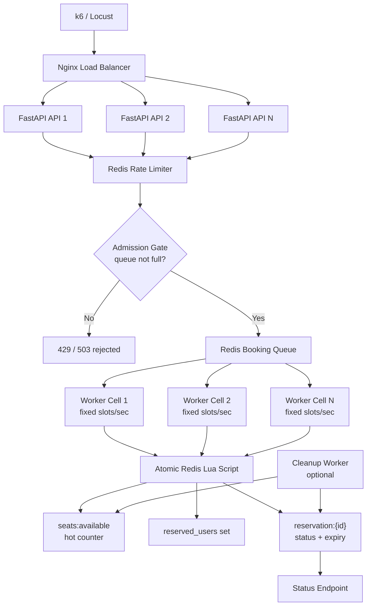

# SE3S Assignment Prototyping 1

This repository contains the prototype setup for the Scalability Engineering prototyping assignment.

The folder structure is now aligned with the selected reservation-system architecture based on Nginx, FastAPI replicas, Redis rate limiting, an admission gate, a Redis booking queue, worker cells, an atomic Redis Lua script, and a reservation status endpoint.

Current MVP workflow:

`POST /events/{event_id}/book` -> Redis queue -> worker -> atomic Redis Lua script -> reservation status in Redis -> `GET /reservations/{reservation_id}`

## Getting Started

### Prerequisites

Make sure the following tools are installed:

```bash
Python >= 3.11
Docker
Docker Compose
Git
```

Optional:

```bash
PyCharm or VS Code
GitHub CLI
```

### Clone Repository

```bash
git clone https://github.com/felix00112/SE3S-Assignment-Prototyping1.git
cd SE3S-Assignment-Prototyping1
```

### Start Application with Docker Compose

```bash
docker compose up --build
```

Or run it in detached mode:

```bash
docker compose up -d --build
```

### Check Running Containers

```bash
docker compose ps
```

Current compose-backed services:

```text
api
redis
```

### Access API

```text
http://localhost:8000
```

### Access FastAPI Documentation

```text
http://localhost:8000/docs
```

## Development Setup

Create a virtual environment:

```bash
python -m venv .venv
```

Activate the virtual environment:

```bash
source .venv/bin/activate
```

Install dependencies:

```bash
pip install -r requirements.txt
```

The application itself should still be started through Docker Compose during development, because Redis is provided as a Docker container.

## Workflow MVP

The currently implemented minimal workflow MVP supports a single flash-sale event and demonstrates the core asynchronous booking architecture:

1. The API accepts a booking request through `POST /events/{event_id}/book`
2. The API writes initial reservation metadata and sets the status to `pending`
3. The API pushes the booking request into a Redis list that acts as the booking queue
4. A worker consumes queue entries with `BLPOP`
5. The worker calls a Redis Lua script to make the reservation decision atomically
6. The Lua script updates the reservation status to a detailed outcome
7. Clients read the current state through `GET /reservations/{reservation_id}`

The current MVP architecture diagram is documented in [docs/architecture/workflow-mvp.md](/Users/felixhauptmann/PycharmProjects/SE3S-Assignment-Prototyping1/docs/architecture/workflow-mvp.md:1), including which parts are already implemented and which are planned next.

Current detailed statuses:

- `pending`
- `reserved`
- `sold_out`
- `duplicate`
- `event_not_found`

## Targeted Architecture

The following diagram shows the intended full architecture beyond the current MVP:



## Running The MVP

Start API and Redis:

```bash
docker compose up --build
```

Start the worker from the repository root in a second terminal:

```bash
python -m workers.cells.worker
```

The current `docker-compose.yml` starts the API and Redis. The worker is still run separately for the MVP.

## Resetting And Smoke Testing

Redis keeps all state between runs, so a new
test run will otherwise inherit stale artifacts.

Two helper scripts live in `scripts/`.

Reset Redis to a clean, seeded state before each run (stop any running worker
first). The optional argument is the number of seats (default 3):

```bash
./scripts/reset.sh        # flush + seed 3 seats
./scripts/reset.sh 5      # flush + seed 5 seats
```

Run the end-to-end smoke test, which resets to 3 seats, starts a worker, runs
the five canonical booking scenarios, and asserts each outcome:

```bash
./scripts/smoke-test.sh
```

Expected output is `PASS` for `user-1..3 -> reserved`, `user-4 -> sold_out`, and
`user-1 -> duplicate`; the script exits non-zero if any case fails. It requires
`api` and `redis` to be running.

Test the per-user rate limiter (asserts that a burst gets throttled with `429`,
that a `Retry-After` header is returned, that other users are unaffected, and
that the bucket recovers after refill):

```bash
./scripts/rate-limit-test.sh
```

This one needs no worker or seat seeding, since rate limiting happens in the API
before a booking is enqueued.
## First GCP Terraform Deployment

The first infrastructure milestone lives in [infrastructure/terraform/gcp/README.md](/Users/felixhauptmann/PycharmProjects/SE3S-Assignment-Prototyping1/infrastructure/terraform/gcp/README.md:1).

It creates `1`, `3`, or `5` Compute Engine VMs using the same machine type. The coordinator node runs Redis, the FastAPI API, and one worker; additional nodes run workers that drain the same Redis booking queue over the private VPC.

Test the admission gate (asserts that a booking is admitted with room, that a
booking is rejected with `503` once the queue is filled to capacity, that a
`Retry-After` header is returned, and that bookings are admitted again after the
queue drains):

```bash
./scripts/admission-gate-test.sh
```

## First GCP Terraform Deployment

The first infrastructure milestone lives in [infrastructure/terraform/gcp/README.md](/Users/felixhauptmann/PycharmProjects/SE3S-Assignment-Prototyping1/infrastructure/terraform/gcp/README.md:1).

It creates `1`, `3`, or `5` Compute Engine VMs using the same machine type. The coordinator node runs Redis, the FastAPI API, and one worker; additional nodes run workers that drain the same Redis booking queue over the private VPC.

## How To Read This Repo

The repository is intentionally split into two kinds of folders:

- executable code folders
  - `services/api/`
  - `workers/cells/`
- architecture and state-contract folders
  - `infrastructure/redis/booking-queue/`
  - `infrastructure/redis/reservation-state/`
  - `infrastructure/redis/lua/`

The important idea is:

- code that runs lives in `services/` and `workers/`
- Redis-related architecture contracts and infrastructure artifacts live in `infrastructure/redis/`

This keeps the repo easy to explain:

- if you want to see what the API does, go to `services/api/`
- if you want to see what the worker does, go to `workers/cells/`
- if you want to understand the queue, Redis state model, or Lua logic, go to `infrastructure/redis/`

These `infrastructure/redis/*` folders are not meant to add overhead. They mainly document the architecture and give the Redis-specific parts of the system a clear home.

## Redis

Connect to Redis:

```bash
docker compose exec redis redis-cli
```

Test Redis:

```redis
PING
```

Expected response:

```text
PONG
```

Seed the prototype event before manual testing:

```redis
SET event:1:seats_available 3
DEL event:1:reserved_users
```

This creates 3 seats for the single-event prototype and clears any previous duplicate-booking state.

## Useful Commands

Rebuild and start all services:

```bash
docker compose up --build
```

Start services in the background:

```bash
docker compose up -d
```

Stop services:

```bash
docker compose down
```

Stop services and remove database volume:

```bash
docker compose down -v
```

View logs:

```bash
docker compose logs api
docker compose logs redis
```

## Current Endpoints

```text
GET /
GET /health
GET /redis-test
POST /events/{event_id}/book
GET /reservations/{reservation_id}
```

## Manual Testing

The manual HTTP scenarios live in [services/api/app/test_main.http](/Users/felixhauptmann/PycharmProjects/SE3S-Assignment-Prototyping1/services/api/app/test_main.http:1).

Recommended test flow after seeding Redis:

1. `user-1` -> expect `reserved`
2. `user-2` -> expect `reserved`
3. `user-3` -> expect `reserved`
4. `user-4` -> expect `sold_out`
5. `user-1` again -> expect `duplicate`

To test `event_not_found`, delete the seat key and run another booking request:

```redis
DEL event:1:seats_available
DEL event:1:reserved_users
```

Then the next booking request should become `event_not_found`.

## Architecture-Oriented Folder Layout

```text
gateway/nginx
services/api
workers/cells
workers/cleanup              # optional
infrastructure/redis
scripts                      # reset + smoke-test helpers
tests/k6
tests/locust                 # optional
docs/architecture
```
