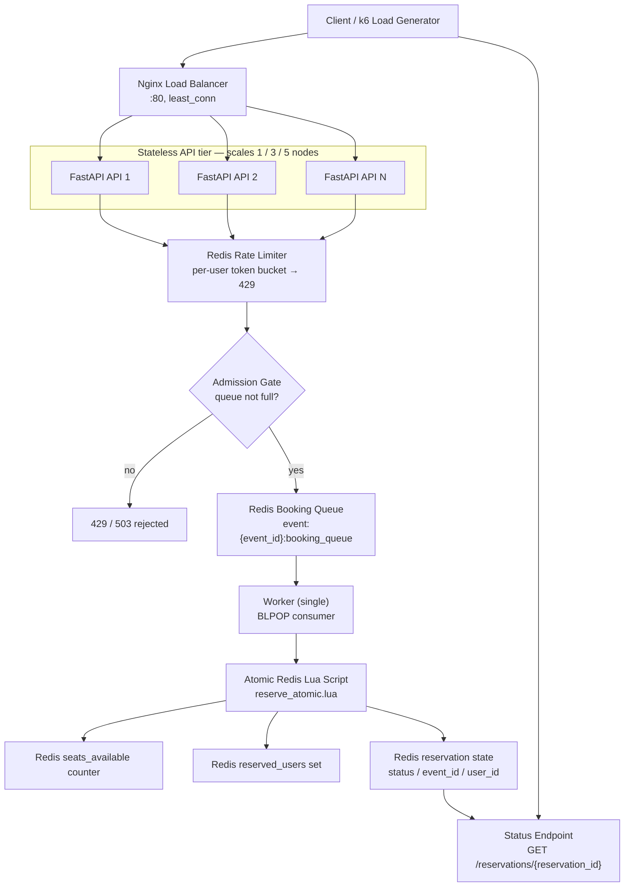

# Workflow MVP

This document describes the implemented booking workflow. Everything below is built
except the optional cleanup worker.

## Diagram

The stateless API tier scales horizontally (deployed as 1 / 3 / 5 nodes of the same
instance type); Redis and the single worker stay singular so the atomic reserve stays
correct regardless of replica count.

## Scope

- Single prototype event (`event:1`)
- Nginx load balancer in front of a horizontally-scaled, stateless FastAPI tier
- Per-user rate limiter (429) and queue-capacity admission gate (503) — overload mitigation
- Redis-backed booking queue
- Single-worker asynchronous processing
- Atomic booking decision via Redis Lua script
- Reservation status lookup endpoint

## Request Flow

1. The load balancer forwards `POST /events/{event_id}/book` (with a `user_id`) to one of the API replicas
2. The API checks the **rate limiter** (per-user token bucket); over-limit → `429`
3. The API generates a `reservation_id`
4. The API checks the **admission gate** (queue-length cap); queue full → `503`
5. On admission, the reservation metadata is written and the payload enqueued atomically:
   - `reservation:{reservation_id}:status = pending`
   - `reservation:{reservation_id}:event_id = {event_id}`
   - `reservation:{reservation_id}:user_id = {user_id}`
   - `RPUSH` a JSON payload into `event:{event_id}:booking_queue`
6. The worker consumes queue items with `BLPOP`
7. The worker calls the Lua script in `infrastructure/redis/lua/reserve_atomic.lua`
8. The Lua script atomically:
   - checks whether the event exists
   - checks whether the user already reserved
   - checks whether seats are still available
   - decrements seat count if possible
   - updates `reservation:{reservation_id}:status`
9. The client polls `GET /reservations/{reservation_id}`

## Detailed Statuses

- `pending`: request accepted and queued
- `reserved`: seat successfully reserved
- `sold_out`: no seats left
- `duplicate`: same user already reserved a seat for this event
- `event_not_found`: seat counter was missing in Redis

## Component Ownership

- API:
  - accepts requests
  - creates reservation metadata
  - enqueues booking jobs
- Worker:
  - consumes queue items
  - invokes Lua script
- Lua script:
  - performs the atomic reservation decision
  - updates only reservation status
- Redis:
  - holds queue, seat counters, reserved-user set, and reservation state

## Why The Redis Docs Exist

The Redis-related documentation is intentionally split by concern:

- [booking-queue.md](/Users/felixhauptmann/PycharmProjects/SE3S-Assignment-Prototyping1/docs/architecture/booking-queue.md:1)
  - documents the queue key and payload contract
  - the queue logic itself is executed by the API and worker

- [reservation-state.md](/Users/felixhauptmann/PycharmProjects/SE3S-Assignment-Prototyping1/docs/architecture/reservation-state.md:1)
  - documents the shared Redis key model for reservation state
  - this is the contract used by API, worker, and Lua script

- `lua/`
  - contains the atomic Redis-side booking logic

This means the repo separates:

- running code
  - API in `services/api/`
  - worker in `workers/cells/`
- Redis executable logic
  - `infrastructure/redis/lua/`
- architecture documentation
  - `docs/architecture/`

The intention is clarity, not extra abstraction.

## Redis Key Modules

There are two `redis_keys.py` files on purpose:

- `shared/redis_keys.py`
  - this is the source of truth for Redis key naming
  - both the API and the worker should ultimately rely on this module
  - it exists in `shared/` because the key contract is not API-specific

- `services/api/app/redis_keys.py`
  - this is a thin compatibility wrapper for the API package
  - it re-exports the helpers from `shared.redis_keys`
  - it allows API code to keep local imports such as `from .redis_keys import ...`

Why this split exists:

- the worker and the API must agree on exactly the same Redis keys
- keeping the real definitions in `shared/` avoids duplicated string logic
- keeping a wrapper in `services/api/app/` avoids a disruptive refactor of API imports

Practical rule:

- if you change the Redis key structure, update `shared/redis_keys.py`
- treat `services/api/app/redis_keys.py` as a wrapper, not a second source of truth
